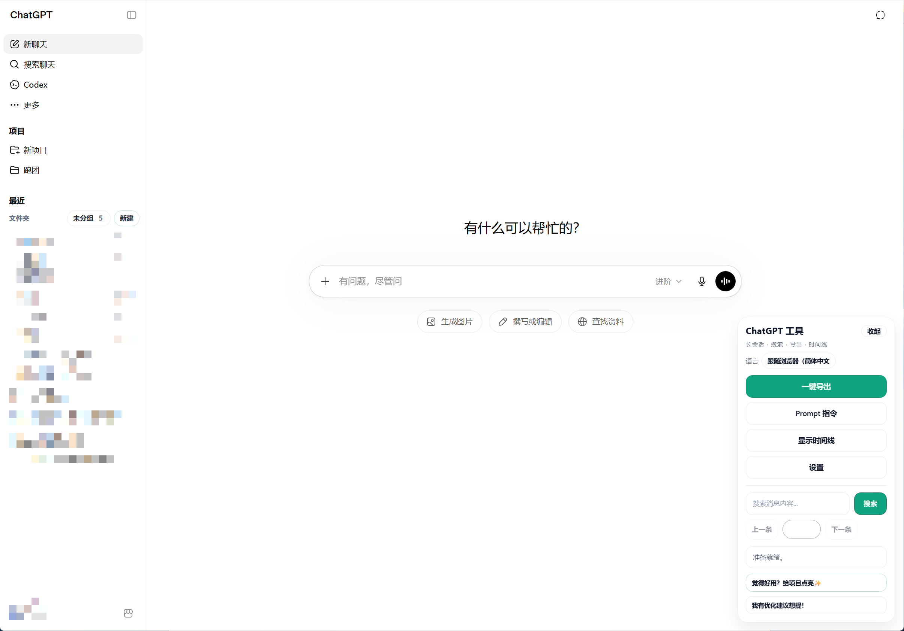

# ChatGPT Conversation Toolkit

[简体中文](./README.md) | English

A browser extension for `ChatGPT Web` focused on full-session export, in-page search, a prompt library, timeline navigation, sidebar folder management, and multilingual UI support.

Current active maintainer: `bujue3709` (primary / sole active maintainer)

Current version: `v1.4.1`

## What's New in v1.4.1 (2026-08-25)

- Adapted to the ChatGPT Web conversation API changes released on 2026-08-22, fixing missing older messages when long conversations are exported through the API.
- API requests now obtain the signed-in session's short-lived access token from `/api/auth/session` and use Bearer authentication to read conversation data. The token is kept only in page memory and is never written to files or browser storage.
- Full active-branch requests now prefer `include_full_conversation=true`, preventing partial message trees returned by the updated API from being treated as complete conversations.
- Added cursor-pagination support for the new `/backend-api/conversations/{id}` endpoints, allowing older message pages to be loaded continuously and rebuilt in their original order.
- Added message-tree completeness validation. If the API fails and export falls back to loaded DOM/cache data, the selection dialog now shows the error code and HTTP status for easier diagnosis.
- Work mode and all other existing features remain unchanged.

## ChatGPT Virtualized List Impact (Important)

Recent ChatGPT Web versions use a virtualized list in the conversation area:

- The browser only keeps part of the nearby message DOM mounted.
- Older messages are loaded on demand during scroll and may be unmounted again when far outside the viewport.

Impact on this extension:

- Search and timeline data prefer the API conversation data, so they can cover more of the full conversation.
- Search and timeline jumps use a unified virtualized-jump flow: locate the target message, wait for ChatGPT to mount the target DOM, then confirm the node by message ID or preview text.
- The old long-conversation cleanup / collapse feature is deprecated. ChatGPT Web's own virtualized list already unmounts messages far outside the viewport, so the extension no longer needs to hide older messages. Extra collapsing can interfere with search, timeline positioning, and native page behavior.

## Supported Sites

- `https://chat.openai.com/*`
- `https://chatgpt.com/*`

## Browser Support

- ✅ `Microsoft Edge` (officially supported)
- ✅ `Google Chrome` (officially supported)
- ⚠️ `Firefox` (temporary loading works; full support hardening is planned)
- ⚠️ `Safari (macOS)` (under evaluation)

## Feature Highlights

- Long conversation cleanup: deprecated legacy collapse behavior. ChatGPT Web's virtualized list already controls DOM size, so the extension no longer needs to hide older messages.
- Flexible export: export all or selected conversation turns as `.json`, `.txt`, or `.md`, with an option to keep only GPT answers.
- In-page search: search within the current conversation, highlight matches, and jump between results. Deep messages are positioned through the virtualized-jump flow.
- Prompt library: add, delete, search, categorize, sort, import JSON, export JSON, and copy prompts with one click.
- Settings panel: tweak core preferences locally via a native-style modal, supporting real-time variable tuning and auto-persistence.
- LaTeX formula copy: hover rendered formulas and copy LaTeX source in one click.
- Timeline navigation: generate user-message timeline nodes from API conversation data, preview them, follow viewport activation, move the timeline panel around, and jump to far nodes.
- Conversation folders: manage chat folders above the native “Your chats” list without replacing native conversation nodes.
- Multilingual UI: currently supports Chinese and English, auto-detects the browser language, falls back to English when no match is available, and can be changed manually from the toolbar.
- Theme sync: the toolbar, timeline, prompt modal, export dialog, and folder UI follow ChatGPT light/dark appearance.
- Draggable floating UI: the minimized toolbar button and timeline can both be dragged.

## Installation

### Chrome

1. Open `chrome://extensions/`
2. Turn on Developer mode
3. Click “Load unpacked”
4. Select the repository root

### Edge

1. Open `edge://extensions/`
2. Turn on Developer mode
3. Click “Load unpacked”
4. Select the repository root

### Firefox

1. Open `about:debugging#/runtime/this-firefox`
2. Click “Load Temporary Add-on”
3. Select [manifest.json](./manifest.json) from the repository root

## Screenshot



## How It Works

### Toolbar

After the page loads, the extension shows a floating toolbar in the bottom-right corner.

Available actions:

- Optimize long conversations (legacy, deprecated, no longer recommended)
- Restore hidden messages
- Export all or selected turns, with an optional GPT-only filter
- Open the prompt library
- Show or hide the timeline
- Search messages
- Settings panel
- Change language

When collapsed, the toolbar becomes a floating button. The button can be dragged and snaps to the nearest edge when released.

The toolbar footer also includes two lightweight links:

- `Like it? Star the project ✨`
- `I have an optimization idea to share!`

### Language Support

- On startup, the extension checks the user’s browser language and tries to match it against the built-in UI languages.
- The extension currently ships with:
  - `English`
  - `简体中文`
- If the browser language does not match a supported locale, the UI falls back to `English`.
- The toolbar header includes a language switcher with:
  - `Browser default`
  - `English`
  - `简体中文`
- Manual changes apply immediately across the toolbar, timeline, prompt library, folder UI, and status messages, and the preference is saved locally.

### Long Conversation Cleanup (Deprecated)

- The old “Optimize long conversations” action reduced DOM size by hiding older messages.
- ChatGPT Web now uses a virtualized list, so messages far outside the viewport are mounted and unmounted by the page itself.
- This feature is deprecated and is no longer part of the recommended workflow. Long-conversation browsing, search, and timeline positioning should rely on API conversation data plus the virtualized-jump flow.
- If an older extension version previously hid messages in a conversation, use “Restore hidden messages” to clear that legacy collapsed state.

### Export

- “Export” lets you choose the full conversation or selected turns, and optionally export GPT answers only.
- Selected-turn mode supports select all, invert, clear, `Shift` range selection, and pagination while preserving selections across pages.
- The footer shows the resulting turn and message counts, and disables export when no messages remain after filtering.
- Settings control the default export format and content; available formats are `.json`, `.txt`, and `.md`.
- Export prefers API conversation data, so it can still export the full conversation even when only part of the virtualized DOM is mounted.
- If API data is unavailable, export falls back to loaded/cached messages and displays a partial-data warning.

### Search

- Enter a keyword in the toolbar search box and press Enter, or click the search button.
- Matches are highlighted in the conversation.
- Use previous / next navigation to move between results.
- Search can find deep messages from API conversation data. When jumping, the extension waits for ChatGPT to mount the target DOM and confirms the node by message ID or preview text.
- If an old collapsed state still hides messages from a previous version, restore hidden messages before searching.

### Timeline

- The timeline sits on the left side of the conversation area.
- It prefers API conversation data to generate user-message nodes, instead of relying only on currently loaded DOM messages.
- The node counter format is `current/total`.
- Hover a node to preview the message.
- Clicking a node jumps to the corresponding message. Deep nodes and first/last nodes use the virtualized-jump flow and are highlighted after the target DOM is mounted.
- The active timeline node follows page scrolling.
- The timeline supports wheel scrolling.
- The timeline panel can be dragged by its header.
- The timeline is off by default and can be toggled from the toolbar.
- If you reach the top of the timeline and there are no more visible messages:
  - it shows `已经没有消息了` when everything is already visible
  - it shows `请恢复隐藏消息` if a legacy collapsed state still exists

### Prompt Library

- Open it from the toolbar.
- Supported actions:
  - search by title, category, or content
  - filter by category
  - sort by update time, title, or category
  - add prompts
  - delete prompts
  - import JSON
  - export JSON
  - copy content with one click
- A success toast appears after copying.

### LaTeX Formula Copy

- When you hover a rendered formula, a `Copy LaTeX` button appears near that formula.
- Clicking it copies the formula's LaTeX source (not rendered plain text).
- The Settings panel can wrap copied formulas as raw LaTeX, Markdown inline `$...$`, Markdown display `$$...$$`, LaTeX inline `\(...\)`, or LaTeX display `\[...\]`.
- Markdown display is recommended when pasting into Obsidian or another Markdown editor; raw LaTeX remains the default.
- Copy success/failure is shown in the toolbar status area.
- For `LaTeX` code blocks, use ChatGPT's native copy button on the right side of the block.

### Conversation Folders

- Folder controls appear above the sidebar “Your chats” heading.
- You can create, rename, delete, collapse, and expand folders.
- You can drag ungrouped conversations into a folder.
- You can drag conversations back out to `Ungrouped`.
- Drop targets include:
  - the folder header
  - the conversation area inside a folder
  - blank space inside the visible managed folder segment
- You can drag folder headers to reorder folders.
- Folder management only adds local classification and ordering in the sidebar. It does not replace native conversation nodes, so native rename, archive, and other built-in conversation actions remain available.
- Folder structure, assignments, collapse state, and order are persisted locally and restored after refresh.

### Settings Panel

- Accessed from the toolbar, it provides a native-style sliding modal for extension settings.
- Allows you to select the chat export format:
  - `.json`
  - `.txt`
  - `.md`
- Allows you to select the default export content:
  - user questions + GPT answers
  - GPT answers only
- Allows you to choose the formula copy format. Raw LaTeX is the default, with Markdown and LaTeX delimiter-wrapped alternatives.
- After clicking "Save", changes apply immediately without a page refresh and automatically persist to local storage.
- The modal natively adapts to the ChatGPT light/dark theme dynamically.

## Support

If this project is useful to you, a GitHub Star is appreciated.


## Project Structure

The extension is split into small modules and loaded in order by `manifest.json`.

```text
core/
  state.js
  i18n.js

features/
  collapse.js
  export.js
  export-selection.js
  folders.js
  search.js
  latex-copy.js
  timeline.js
  prompt-library.js

ui/
  theme.js
  toolbar.js

utils/
  dom.js
  storage.js

contentScript.js
styles.css
manifest.json
```

## Module Overview

- [core/state.js](./core/state.js)
  Runtime constants, shared state, and base configuration.
- [core/i18n.js](./core/i18n.js)
  UI dictionaries, browser-language detection, language switching, and localized UI refresh.
- [utils/dom.js](./utils/dom.js)
  DOM helpers, message node detection, and shared drag scheduling.
- [utils/storage.js](./utils/storage.js)
  Local persistence for UI state, positions, visibility, and saved data.
- [ui/theme.js](./ui/theme.js)
  ChatGPT theme detection and UI theme synchronization.
- [ui/toolbar.js](./ui/toolbar.js)
  Floating toolbar, minimize button, and related drag interactions.
- [features/collapse.js](./features/collapse.js)
  Deprecated legacy long-conversation collapse and restore behavior, kept only for compatibility with older collapsed states.
- [features/export.js](./features/export.js)
  Conversation export.
- [features/export-selection.js](./features/export-selection.js)
  Turn selection, role filtering, pagination, and selective export.
- [features/folders.js](./features/folders.js)
  Sidebar folder management, drag classification, folder sorting, and local restore.
- [features/search.js](./features/search.js)
  Message search and result navigation.
- [features/latex-copy.js](./features/latex-copy.js)
  Hover button for rendered formulas and one-click LaTeX source copy.
- [features/timeline.js](./features/timeline.js)
  Timeline rendering, preview, scrolling, dragging, and active-node synchronization.
- [features/prompt-library.js](./features/prompt-library.js)
  Prompt library CRUD, filtering, copying, import, and export.
- [contentScript.js](./contentScript.js)
  Bootstrap entry point, initialization, and DOM observer wiring.
- [styles.css](./styles.css)
  Styles for the toolbar, timeline, prompt modal, and folder UI.

## Configuration

Common settings live in [core/state.js](./core/state.js).

Example:

```js
const TIMELINE_VISIBLE_NODE_CAPACITY = 10;
const TIMELINE_MAX_NODES = 20;
const COLLAPSE_AUTO_REOPTIMIZE_BUFFER = 10;

const state = {
  isCollapsed: false,
  isMinimized: false,
  keepLatest: 20,
  collapsedNodes: [],
  cachedNodes: [],
};
```

Key fields:

- `keepLatest`: legacy long-conversation cleanup setting; the cleanup feature is deprecated
- `COLLAPSE_AUTO_REOPTIMIZE_BUFFER`: legacy auto-cleanup buffer; the cleanup feature is deprecated
- `TIMELINE_VISIBLE_NODE_CAPACITY`: approximate number of timeline nodes visible in one screenful
- `TIMELINE_MAX_NODES`: maximum sampled timeline node count
- `exportFormat`: default export format; supports `json`, `txt`, and `md`
- `exportRole`: default export content; supports `all` or `assistant`
- `latexCopyFormat`: formula copy format; supports `raw`, `markdown-inline`, `markdown-block`, `latex-inline`, and `latex-display`

## Exported Conversation JSON

```json
{
  "exportedAt": "2026-03-13T08:30:00.000Z",
  "url": "https://chatgpt.com/c/xxxxxxxx",
  "exportScope": "all",
  "roleFilter": "all",
  "sourceMessageCount": 2,
  "selectedTurnCount": 1,
  "messageCount": 2,
  "messages": [
    {
      "index": 1,
      "role": "user",
      "text": "Your message"
    },
    {
      "index": 2,
      "role": "assistant",
      "text": "ChatGPT response"
    }
  ]
}
```

Field notes:

- `exportedAt`: export timestamp in ISO 8601 format
- `url`: current conversation URL
- `messageCount`: total exported message count
- `messages`: message array
- `messages[].index`: message order
- `messages[].role`: usually `user` or `assistant`
- `messages[].text`: plain text content
- `exportScope`: export range, either `all` or `selected`
- `roleFilter`: role filter, either `all` or `assistant`
- `sourceMessageCount`: message count before filtering
- `selectedTurnCount`: number of included conversation turns
- `messages[].sourceIndex`: original conversation position for filtered exports

## Prompt Library JSON

The prompt library exports as an object:

```json
{
  "version": 1,
  "updatedAt": "2026-03-13T08:30:00.000Z",
  "prompts": [
    {
      "id": "c94f7299-40f3-4f95-a9f7-0ff93029a3f8",
      "title": "Daily Summary",
      "category": "Work",
      "content": "Summarize today’s work by completed items, risks, and next steps.",
      "createdAt": 1741576200000,
      "updatedAt": 1741576200000
    }
  ]
}
```

Field notes:

- `version`: format version, currently `1`
- `updatedAt`: library-level update timestamp
- `prompts`: prompt array
- `prompts[].id`: unique ID
- `prompts[].title`: title
- `prompts[].category`: category
- `prompts[].content`: prompt body
- `prompts[].createdAt`: creation timestamp
- `prompts[].updatedAt`: update timestamp

### Supported Import Shapes

The library supports two import shapes:

#### Object shape

```json
{
  "prompts": [
    {
      "title": "Code Review",
      "category": "Development",
      "content": "List issues by severity and suggest fixes."
    }
  ]
}
```

#### Array shape

```json
[
  {
    "title": "Requirement Breakdown",
    "category": "Product",
    "content": "Break this down into tasks with priorities and acceptance criteria."
  }
]
```

Import rules:

- records with empty `content` are ignored
- empty `title` values are generated from the content
- empty `category` values fall back to `未分类`
- duplicates are removed using `title + category + content`, case-insensitive

## Development Notes

- This project does not use a bundler.
- After changing scripts, reload the extension from the browser extensions page.
- Script execution order is defined by the `content_scripts.js` array in [manifest.json](./manifest.json).

## Known Limitations

- Timeline and search prefer API conversation data, so they can cover more of the full conversation.
- Jumping still depends on ChatGPT Web eventually mounting the target DOM. The extension retries automatically, but major ChatGPT DOM changes may require selector updates.
- Long-conversation cleanup is deprecated. If a legacy collapsed state still exists, restore hidden messages before in-page positioning.
- LaTeX copy mainly targets rendered formula nodes. For `LaTeX` code blocks, use ChatGPT's native copy button.
- Folder management depends on the current ChatGPT sidebar DOM structure and stores classification locally. It does not sync to the ChatGPT service.
- ChatGPT DOM changes may require selector updates over time.

## Maintainer

This project is currently maintained by `bujue3709` as the sole active maintainer.

## License

This project is licensed under the [MIT License](./LICENSE).

You are free to use, modify, publish, distribute, and sell copies of the software as allowed by MIT, provided the license notice is kept with the software.

### Non-license Note

Please do not misrepresent the original project name, authorship, or branding. If you distribute a modified or unofficial version, label it clearly. This note is only to prevent confusion and does not add extra license restrictions.
